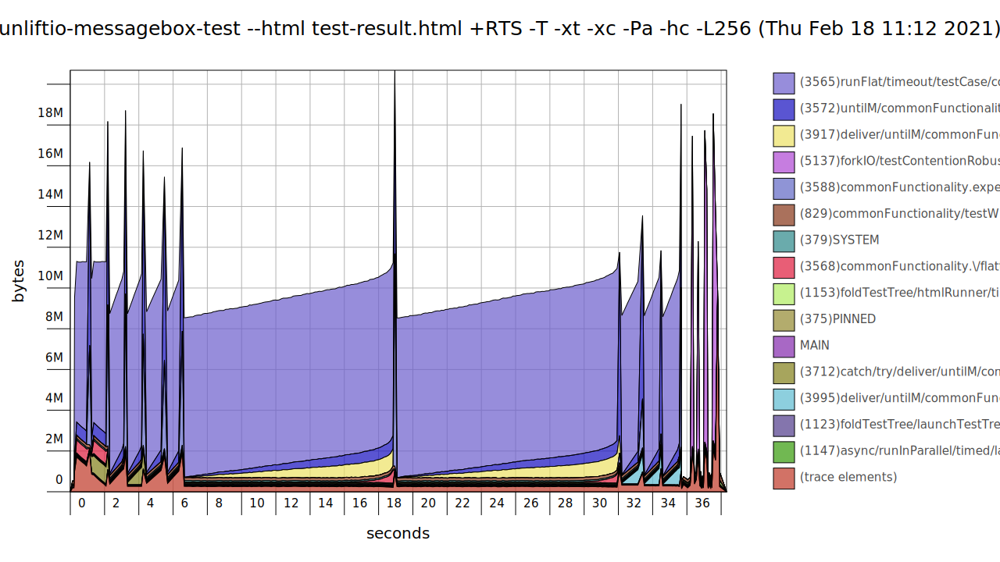

# Fast and Safe Message Passing Between Concurrent Processes

**NOTE:** To be able to fully view this README, use the [web page](https://sheyll.github.io/unliftio-messagebox/).

A small library that wraps around a hopefully safe subset 
of `unagi-chan`.

It is also based on `unliftio`.

The goal is to reduce the risk of live and dead locks and 
thread starvation, as well as acceptable performance 
even in massively concurrent programs.

The library assumes an architecture with a large number 
of concurrent processes communicating either one-to-one or
few-to-many using messages passed to limited queues.

You probably don't want to ever write an application structured
like this, unless you absolutely have to.
## Module Structure

The library is contained in modules with names starting with 
**UnliftIO.MessageBox**.

Also the module 
[UnliftIO.MessageBox (generated)](./generated-reports/haddock-report/unliftio-messagebox/index.html)
[UnliftIO.MessageBox (Hackage)](http://hackage.haskell.org/package/unliftio-messagebox/docs/UnliftIO-MessageBox.html)
exposes the API, and can be used to import everything.

See: [Haddock generation log](./generated-reports/haddock-report/build.log)

## Benchmarks

* [Single Core Results](./generated-reports/benchmark-report/benchmark-1-CORES.html)
* [Multi Core Results](./generated-reports/benchmark-report/benchmark-ALL-CORES.html)

## Unit Tests

* [Test Results](./generated-reports/test-profiling-report/test-result.html)
* [Test Coverage](./generated-reports/test-coverage-report/hpc_index.html)
### Heap Profiling

[Test Heap Profiling Report (HTML)](./generated-reports/test-profiling-report/unliftio-messagebox-test.html)
### Profiling

[Test Profiling Report](./generated-reports/test-profiling-report/unliftio-messagebox-test.prof)

## Memory Leak Test 

This is a subset of the benchmark, that is repeated for many iterations.
After each iteration, the memory usage is queried from the GHC runtime 
statistics.

The output is printed into [this log file](./generated-reports/memleak-test-report/test.log).

The test program is executated with the `+RTS -M400m` option that instructs
the runtime to limit the available heap to 300MB, so when there is a memory
leak, the program would at some point crash with a heap exhaustion error.
