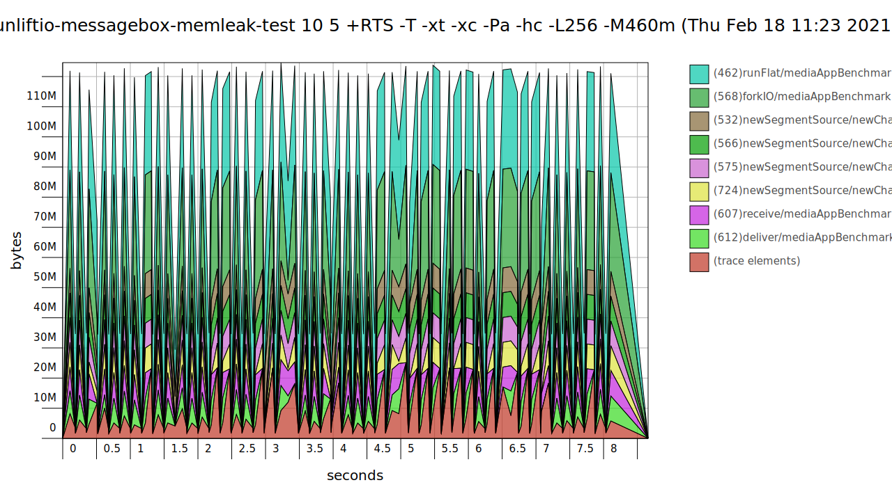

# Fast and Robust Message Queues for Concurrent Processes

**NOTE:** To be able to fully view this README, use the [GitHub Pages Version](https://sheyll.github.io/unliftio-messagebox/).
* [API docs](./generated-reports/haddock-report/unliftio-messagebox)
* [API docs on Hackage](http://hackage.haskell.org/package/unliftio-messagebox)

A thin wrapper around a subset of `unagi-chan` based on `unliftio`.

The unit tests and benchmarks in this project excercise a subset 
of `unagi-chan`, so hopefully the user of this library doesn't
have to worry about this.

This project also aims to implicitly verify parts of `unagi-chan`.

The overall goal is to reduce the risk of live and dead locks and 
thread starvation, as well as acceptable performance 
even in massively concurrent programs.

## Module Structure

The library is contained in modules with names starting with 
**UnliftIO.MessageBox**.

Also the module 
`UnliftIO.MessageBox` [(API docs)](./generated-reports/haddock-report/unliftio-messagebox/UnliftIO-MessageBox.html)
[(Hackage)](http://hackage.haskell.org/package/unliftio-messagebox/docs/UnliftIO-MessageBox.html)
exposes the API, and can be used to import everything.

The full documentation is either [on this page](./generated-reports/haddock-report/unliftio-messagebox/index.html)[(build log)](./generated-reports/haddock-report/build.log)
or on [Hackage](http://hackage.haskell.org/package/unliftio-messagebox).

## Benchmarks

* [Single Core Results](./generated-reports/benchmark-report/benchmark-1-CORES.html)
* [Multi Core Results](./generated-reports/benchmark-report/benchmark-ALL-CORES.html)

## Unit Tests

* [Test Results](./generated-reports/test-profiling-report/test-result.html)
* [Test Coverage](./generated-reports/test-coverage-report/hpc_index.html)
### Heap Profiling

### Time Profiling

[Test Profiling Report](./generated-reports/test-profiling-report/unliftio-messagebox-test.prof)

## Memory Leak Tests

This is a small application with a 1002 processes, each performing a fix amount of 
work.

When the work is done, all processes synchronise before starting a new iteration.
After each iteration, the memory usage is queried from the GHC runtime 
statistics.
There are 10 iterations like that. 

After that all processes are shutdown, and the process
starts all over again, 5 times.

In total 50 iterations.

If memory is leaked it should become visible.

The test program is executed with the `+RTS -Mxxxm` option that instructs
the runtime to limit the available heap to `xxx` MB, so if there is a memory
leak, the program would at some point crash with a heap exhaustion error.

The output is printed into [this log file](./generated-reports/messagebox-memleak-test-report/test.log).
